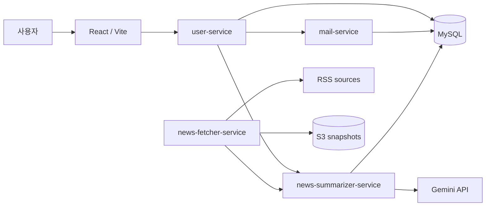

# Patrasche App

Patrasche는 RSS 뉴스를 수집·요약하고 사용자의 관심 카테고리에 맞춰 뉴스 목록과 이메일 알림을 제공한 팀 프로젝트입니다. 이 저장소는 React/Vite 프론트엔드, 기능별 FastAPI 서비스, 테스트와 애플리케이션 배포 자동화를 관리합니다.

> 프로젝트 운영은 종료되었으며 현재 라이브 데모를 제공하지 않습니다. 운영 Secret과 실제 환경 설정은 저장소에 포함하지 않습니다.

- 애플리케이션 저장소: <https://github.com/Patrasche-s/patrasche-app>
- 인프라 저장소: <https://github.com/Patrasche-s/patrasche-infra>

## 서비스 흐름



## 주요 기능

- 관심 카테고리 기반 이메일 구독, 인증과 구독 해지
- RSS 뉴스 수집과 원문 snapshot 저장
- 생성형 AI를 활용한 뉴스 요약과 조회 API
- 인증 메일 및 뉴스레터 발송과 발송 이력 관리
- Docker 이미지 빌드, 보안 검사, 테스트와 EKS 배포 자동화

## 서비스 구성

| Service | Port | 역할 |
| --- | ---: | --- |
| `frontend` | 80 | 구독, 인증과 뉴스 조회 UI |
| `user-service` | 8000 | 구독, 인증, 해지와 뉴스 목록 API |
| `mail-service` | 8002 | 인증 메일과 뉴스레터 발송 |
| `news-fetcher-service` | 8003 | RSS 수집, 요약 요청과 S3 snapshot 업로드 |
| `news-summarizer-service` | 8004 | 뉴스 요약, 저장과 내부 조회 API |

## 저장소 구조

```text
.
├── frontend/                  # React/Vite 웹 애플리케이션
├── backend/                   # FastAPI 서비스와 Dockerfile
├── ansible/                   # 프로젝트 당시 EKS 배포 playbook
└── Jenkinsfile-app            # 검사, build, push와 배포 파이프라인
```

인프라 리소스, Kubernetes manifest와 플랫폼 구성은 [Patrasche Infra](https://github.com/Patrasche-s/patrasche-infra)에서 관리합니다.

## CI/CD 흐름

1. Jenkins가 Gitleaks, Trivy, flake8와 pytest를 실행합니다.
2. 배포할 `IMAGE_TAG`를 40자리 Git commit SHA로 고정합니다.
3. 프론트엔드와 백엔드 이미지를 빌드해 Amazon ECR에 push합니다.
4. Ansible playbook이 EKS Deployment와 fetcher CronJob의 image tag를 갱신합니다.
5. Kubernetes rollout 상태를 확인해 배포 결과를 검증합니다.

## 환경 변수와 Secret

운영 환경의 DB, SMTP, 외부 API key와 내부 token 값은 애플리케이션 코드에 저장하지 않고 SSM Parameter Store와 External Secrets Operator를 통해 주입하도록 구성했습니다. 로컬 실행에 필요한 변수는 각 서비스 README를 참고하고 `.env` 파일은 Git에 커밋하지 않습니다.

## 로컬 실행 예시

프론트엔드:

```bash
cd frontend
npm install
npm run dev
```

백엔드 예시:

```bash
cd backend/user-service
pip install -r requirements.txt
alembic upgrade head
uvicorn main:app --host 0.0.0.0 --port 8000
```

전체 백엔드 구조와 테스트 방법은 [`backend/README.md`](backend/README.md), 서비스별 환경 변수는 각 서비스 README에서 확인할 수 있습니다.

## 프로젝트 기간 검증 범위

- 프론트엔드와 네 개 FastAPI 서비스의 EKS 배포
- RDS 연결과 서비스별 Alembic migration
- RSS 수집, Gemini 요약과 S3 snapshot 저장
- 이메일 인증, 뉴스레터 발송과 구독 해지
- SSM / ExternalSecret / Kubernetes Secret 기반 설정 주입
- Jenkins 기반 검사, 이미지 build/push와 rollout

이 항목은 프로젝트 운영 기간에 검증한 결과를 정리한 것이며, 현재 라이브 환경의 가용성을 의미하지 않습니다.

## Ansible 구현 범위

`ansible/setup-addons.yml`과 관련 playbook은 프로젝트 당시의 EKS cluster, AWS region, domain과 Jenkins 실행 환경을 기준으로 작성한 구현 기록입니다. 특히 `setup-addons.yml`에는 AWS Load Balancer Controller 재설치 단계가 포함되어 있습니다. 범용 설치 도구로 제공하는 파일이 아니므로 다른 환경에서 실행하려면 변수, 권한과 task 흐름을 먼저 검토해야 합니다.
